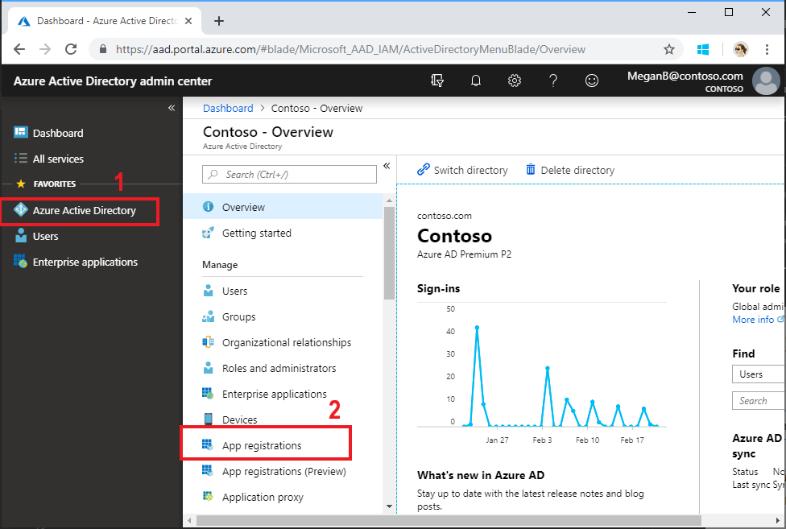
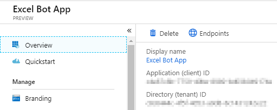
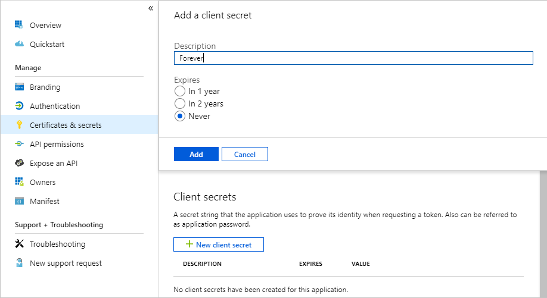
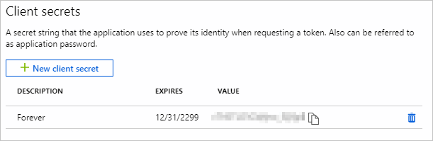

# Excel Bot

## Table of Contents. ##

[Introduction.](#introduction)

[Prerequisites.](#prerequisites)

[Cloning or downloading this repository.](#Cloning-or-downloading-this-repository)

[Configure your Azure AD tenant.](#Configure-your-Azure-AD-tenant)

[Register the bot.](#Register-the-bot)

[Give us your feedback](#Give-us-your-feedback)

## Introduction.

Excel Bot is a sample that demonstrates how to use the [Microsoft Graph](https://graph.microsoft.io) and specifically the [Excel REST API](https://graph.microsoft.io/en-us/docs/api-reference/v1.0/resources/excel) to access Excel workbooks stored in OneDrive for Business through a conversational user interface. It is written in C# and it uses the [Microsoft Bot Framework](https://dev.botframework.com/) and the [Language Understanding Intelligent Service (LUIS)](https://www.luis.ai/).

*Note*: The code in this sample was originally written for a user experience prototype and does not necessarily demonstrate how to create production quality code.

## Prerequisites.

This sample requires the following:  

- Visual Studio 2017.
- An Office 365 for business account. You can sign up for an [Office 365 Developer subscription](https://msdn.microsoft.com/en-us/office/office365/howto/setup-development-environment) that includes the resources that you need to start building Office 365 apps.

## Cloning or downloading this repository.

- Clone this repo to a local folder

    ` git clone https://github.com/nicolesigei/botframework-csharp-excelbot-rest-sample.git `

## Configure your Azure AD tenant.

1. Open a browser and navigate to the [Azure Active Directory admin center](https://aad.portal.azure.com). Login using a **Work or School Account**.

1. Select **Azure Active Directory** in the left-hand navigation, then select **App registrations** under **Manage**.

    

1. Select **New registration**. On the **Register an application** page, set the values as follows.

    - Set a preferred **Name** e.g. `Excel Bot App`.
    - Set **Supported account types** to **Accounts in any organizational directory**.
    - Under **Redirect URI**, set the first drop-down to `Web` and set the value to http://localhost:3978/callback.

    

    > **Note:** If you are running this locally and on Azure, you should add two redirect URLs here, one to your local instance and one to your Azure web app.
    
1. Choose **Register**. On the **Excel Bot App** page, copy the value of the **Application (client) ID** and save it, you will need it to configure the app.

    

1. Select **Certificates & secrets** under **Manage**. Select the **New client secret** button. Enter a value in **Description** and select one of the options for **Expires** and choose **Add**.

    

1. Copy the client secret value before you leave this page. You will need it to configure the app.

    > [!IMPORTANT]
    > This client secret is never shown again, so make sure you copy it now.

    
    
## Register the bot.

Complete the these steps to setup your development environment to build and test the Excel bot:

- Download and install the [Azure Cosmos DB Emulator](https://docs.microsoft.com/en-us/azure/cosmos-db/local-emulator)

- Make a copy of **./ExcelBot/PrivateSettings.config.example** in the same directory. Name the file  to **PrivateSettings.config**.
- Open the ExcelBot.sln solution file
- Register the bot in the [Bot Framework](https://dev.botframework.com/bots/new)
- Copy the bot MicrosoftAppId and MicrosoftAppPassword to the PrivateSettings.config file
- Register the bot to call the Microsoft Graph.
- Copy the Azure Active Directory **Client Id** and **Secret** to the PrivateSettings.config file
- Create a new model in the [LUIS](https://www.luis.ai) service
- Import the LUIS\excelbot.json file into LUIS
- Train and publish the LUIS model
- Copy the LUIS model id and subscription key to the Dialogs\ExcelBotDialog.cs file
- (Optional) Enable Web Chat for the bot in the Bot Framework and copy the Web Chat embed template the chat.htm file
- (Optional) To get the bot to send telemetry to [Visual Studio Application Insights](https://azure.microsoft.com/en-us/services/application-insights/), copy the instrumentation key to the following files: ApplicationInsights.config, default.htm, loggedin.htm, chat.htm
- Build the solution
- Press F5 to start the bot locally
- Test the bot locally with the [Bot Framework Emulator](https://docs.botframework.com/en-us/tools/bot-framework-emulator)
- Create an Azure Cosmos DB in Azure that uses the SQL API
- Replace the bots host name in the PrivateSettings.config file
- Replace the database URI and key in the PrivateSettings.config file
- Publish the solution to the Azure web app
- Test the deployed bot using the Web Chat control by browsing to the chat.htm page  

## Give us your feedback

Your feedback is important to us.  

Check out the sample code and let us know about any questions and issues you find by [submitting an issue](https://github.com/microsoftgraph/botframework-csharp-excelbot-rest-sample/issues) directly in this repository. Provide repro steps, console output, and error messages in any issue you open.

This project has adopted the [Microsoft Open Source Code of Conduct](https://opensource.microsoft.com/codeofconduct/). For more information see the [Code of Conduct FAQ](https://opensource.microsoft.com/codeofconduct/faq/) or contact [opencode@microsoft.com](mailto:opencode@microsoft.com) with any additional questions or comments.

## Copyright

Copyright (c) 2019 Microsoft. All rights reserved.
  
